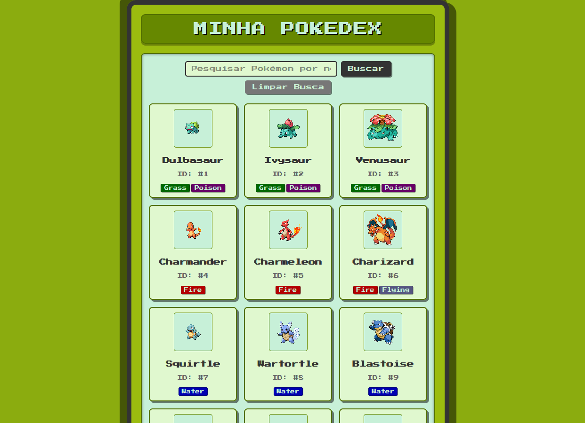
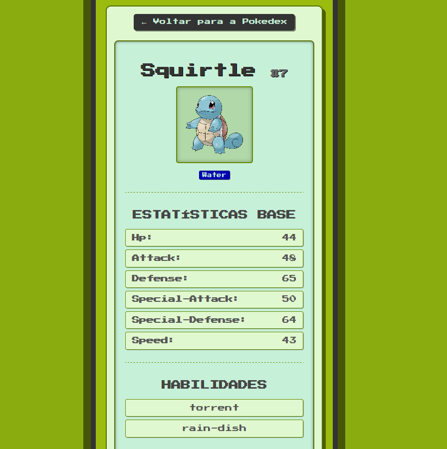

# Pokemon Pokedex Project

## Description

This is a full-stack web application that functions as a simple Pokédex, allowing users to browse a list of Pokémon, search for specific ones by name or ID, and view detailed information for each Pokémon, including their stats, abilities, types, and evolution chain.

The application is split into two main parts: a React frontend for the user interface and a Node.js (Express) backend to serve as an API gateway to the PokeAPI.

[Application-here](https://pokedex-frontend-app.vercel.app/)

## Features

- iew Pokémon List: Browse a paginated list of Pokémon.
- Search Functionality: Find specific Pokémon quickly by entering their name or ID.
- Detailed Pokémon View: Click on any Pokémon to see a dedicated page with comprehensive information (stats, types, abilities, height, weight, and their cry).
- Responsive Design: Optimized for various screen sizes (desktop and mobile).
- Game Boy-inspired Styling: A nostalgic visual theme reminiscent of classic Pokémon games on the Game Boy.

## Technologies

### Frontend

- React: A JavaScript library for building user interfaces.
- React Router DOM: For declarative routing in React applications.
- Axios: A promise-based HTTP client for making API requests.
- CSS: For styling, with a custom retro Game Boy theme.
- create-react-app: The toolchain used to set up the React project.

### Backend

- Node.js: A JavaScript runtime built on Chrome's V8 JavaScript engine.
- Express.js: A fast, unopinionated, minimalist web framework for Node.js.
- Axios: For making HTTP requests to the external PokeAPI.
- CORS: Middleware to enable Cross-Origin Resource Sharing.

## API

This project utilizes the [PokeAPI](https://pokeapi.co/docs/v2) to fetch all Pokémon data. The backend acts as an intermediary, consuming data from PokeAPI and serving it to the frontend.

## Deployment

This application is designed to be deployed with separate hosting services for the frontend and backend.

### Backend Deployment (e.g., Render)

The backend API is deployed using a service like Render.

1. Push your backend folder to a GitHub repository.
2. Create a new Web Service on Render.com.
3. Connect your GitHub repository.
4. Configure the service with Node runtime, npm install build command, and npm start start command.
5. Once deployed, copy the provided public URL (e.g., https://your-backend-api.onrender.com).

### Frontend Deployment (e.g., Vercel)

The React frontend is deployed using a service like Vercel.

1. Before deploying the frontend, ensure your backend is deployed and you have its public URL.
2. Update the REACT_APP_API_BASE_URL in your frontend's .env file (and subsequently, in Vercel's Environment Variables settings) with the public URL of your deployed backend.
3. `REACT_APP_API_BASE_URL=https://your-backend-api.onrender.com/api # Use your actual Render URL`
4. Push your client (or frontend) folder to a GitHub repository.
5. Create a new Project on Vercel.com.
6. Connect your GitHub repository containing the frontend code.
7. In Vercel's project settings, go to "Environment Variables" and add REACT_APP_API_BASE_URL with the value of your deployed backend URL.
8. Deploy the project. Vercel will automatically detect the React setup.

Your live Pokédex will then be accessible via the public URL provided by Vercel.

## Screenshots

